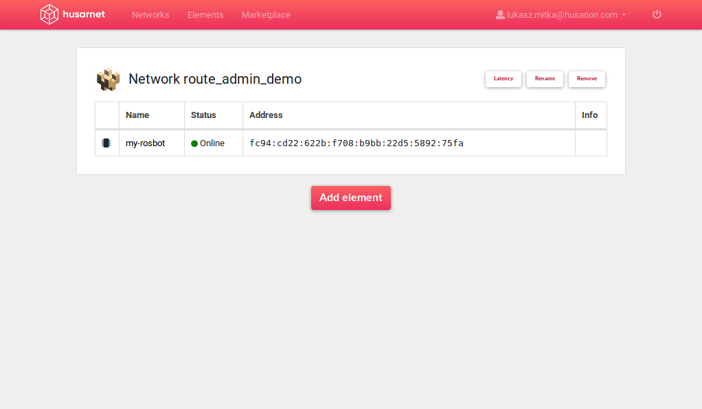
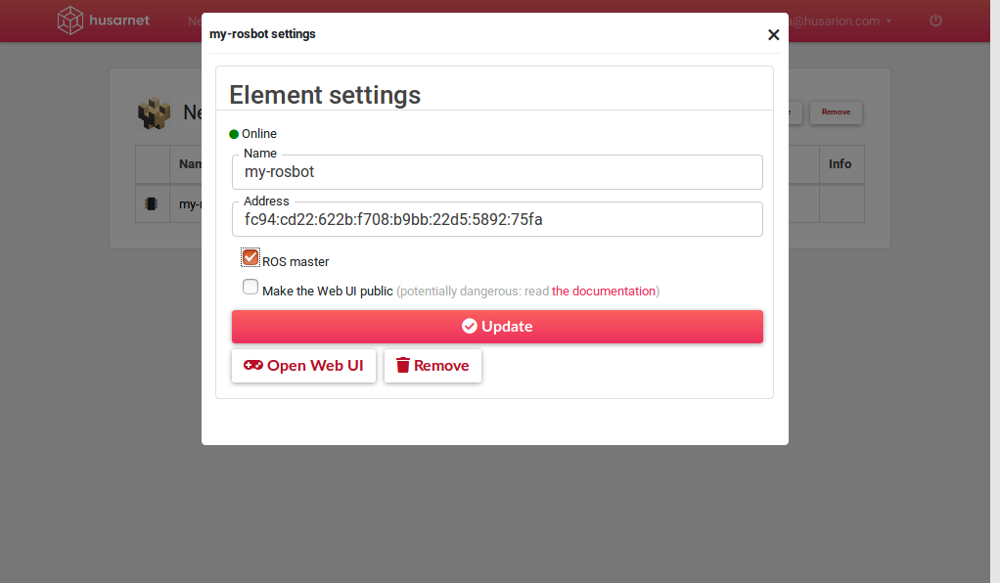

## About

The **Route admin panel** is a web user interface for managing routes of ROS based mobile robots.

It allows to:
- Define destination points
- Save robot position as destination point
- Send destination point to navigation stack
- Upload custom map
- Set a sequence of destination points

The **Route admin panel** is built as a [Node.js](https://nodejs.org/) application. On one side it is interfacing with ROS topics, while on another side it presents a frontend for managing robot destinations.

## Installation

Install [Node.js](https://nodejs.org/):

```bash
curl -sL https://deb.nodesource.com/setup_10.x | sudo -E bash -
sudo apt install -y nodejs
```

Create workspace and clone dependency repositories, it may happen that you already have it done, in that case, skip this step:

```bash
mkdir ~/ros_workspace
mkdir ~/ros_workspace/src
cd ~/ros_workspace/src
echo '. ~/ros_workspace/install/setup.sh' >> ~/.bashrc

git clone -b ros2 --single-branch https://github.com/husarion/rosbot_description.git
```

Clone `route_admin_panel` repository:

```bash
cd ~/ros_workspace/src
git clone -b ros2 --single-branch https://github.com/husarion/route_admin_panel.git
```

Build workspace:

```bash
cd ~/ros_workspace
colcon build
. ~/ros_workspace/install/setup.sh
```

Install nodejs packages:

```bash 
cd ~/ros_workspace/install/route_admin_panel/share/route_admin_panel/nodejs
npm install express socket.io quaternion-to-euler math3d multer yargs uuid
wget https://forked-rclnodejs.s3-eu-west-1.amazonaws.com/rclnodejs-0.10.3.tgz
npm install rclnodejs-0.10.3.tgz
npm install
mkdir user_maps
echo '{"targetList": {"targets": []}}' > user_maps/config.json
```


## How to use

Panel comes with prepared launch files for standalone panel or to run it with ROSbot, both contain all components required to run panel.
Depending on your ROSbot version, you can start it with:

- standalone panel

    ```bash
    ros2 launch route_admin_panel panel.launch.py
    ```

- for ROSbot 2.0:

    ```bash
    ros2 launch route_admin_panel panel_rosbot.launch.py
    ```

- for ROSbot 2.0 PRO:

    ```bash
    ros2 launch route_admin_panel panel_rosbot_pro.launch.py
    ```

- for Gazebo simulator:

    ```bash
    ros2 launch route_admin_panel panel_sim.launch.py
    ```

Once all nodes are running, go to web browser and type in address bar:

```bash
ROSBOT_IP_ADDRESS:8000
```
You need to substitute phrase `ROSBOT_IP_ADDRESS` with IP address of your device.

You should see interface like below:


# ROS API

Below are ROS interfaces used by the route admin panel:

### Topics

| Topic | Message type | Direction |&nbsp;&nbsp;&nbsp;&nbsp;&nbsp;&nbsp;&nbsp;&nbsp;&nbsp;&nbsp;&nbsp;&nbsp;Description&nbsp;&nbsp;&nbsp;&nbsp;&nbsp;&nbsp;&nbsp;&nbsp;|
| --- | --- | --- | --- |
| `/tf` | `tf2_msgs/msg/TFMessage` | subscriber | Transform from `map` to `base_link` frame |
| `/map_image/full/compressed` | `sensor_msgs/msg/CompressedImage` | subscriber | Map converted to grayscale image and compressed in PNG format |
| `/map_metadata` | `nav_msgs/msg/MapMetaData` | subscriber | Metadata for map |


### Actions

| Action name | Action type | Role |&nbsp;&nbsp;&nbsp;&nbsp;&nbsp;&nbsp;&nbsp;&nbsp;&nbsp;&nbsp;&nbsp;&nbsp;Description&nbsp;&nbsp;&nbsp;&nbsp;&nbsp;&nbsp;&nbsp;&nbsp;|
| --- | --- | --- | --- |
| `NavigateToPose` | `nav2_msgs/action/NavigateToPose` | client | Set destinations for navigation stack. |

### Map to image conversion

Additional node `map_to_img_node` for conversion from `nav_msgs/msg/OccupancyGrid` to `sensor_msgs/msg/CompressedImage` has interfaces:

| Topic | Message type | Direction |&nbsp;&nbsp;&nbsp;&nbsp;&nbsp;&nbsp;&nbsp;&nbsp;&nbsp;&nbsp;&nbsp;&nbsp;Description&nbsp;&nbsp;&nbsp;&nbsp;&nbsp;&nbsp;&nbsp;&nbsp;|
| --- | --- | --- | --- |
| `/map` | `nav_msgs/msg/OccupancyGrid` | subscriber | Map source |
| `/map_metadata` | `nav_msgs/msg/MapMetaData` | publisher | Metadata for map |
| `/map_image/full` | `sensor_msgs/msg/Image` | publisher | Map converted to grayscale image |

Node is using `image_transport::ImageTransport` plugin to provide compressed images. RAP accepts only PNG compressed image, thus parameters for this image transport must be as follows:

```
map_to_img_node:
    ros__parameters:
        publish_map_metadata: true
        format: png
```

 
## Using panel from any network

In case you would like to manage robot destinations outside of local network, you could use [Husarnet](https://husarnet.com/) for secure connection with your robot.

All Husarion devices comes with Husarnet preisntalled, if you are using your own device, install Husarnet according to [installation guide](https://docs.husarnet.com/install/).

If you do not have a Husarnet account, create it and log in to [Husarnet dashboard](https://app.husarnet.com/).

In Husarnet dashboard, click **Create network** button, you will get a dialog:


Type `route_admin_demo` as network name then click **Create** button.

Go to your device and register it in Husarnet network by executing in terminal:

```
sudo husarnet websetup
```

You will get a registration link as a response, open it in web browser:


- In **Name for this device** provide `my-rosbot`
- In **Add to network** dropdown menu choose `route_admin_demo`
- Check **Change device hostname** checkbox
- Click **Add device to your account** button

You will be redirected to network summary view:



Click device name to open its configuration:



Check **ROS master** checkbox.

Optionally you can also check **Make the Web UI public** if you want to make panel accessible for anyone knowing device address.

Go back to your device and start panel with the same launch file as for local network.

Once the panel is running, you will notice new button **WebUI** next to your device address in Husarnet dashboard, use this button to view panel.


***Wait! But what about real peer-to-peer connection?***

To get access without need to log into any server, you will have to install Husarnet client also on your laptop, procedure is the same as for any other device.

Then register your laptop in Husarnet network the same way as you did with robot.

On laptop open browser and in address bar type: `[ROSBOT_HUSARNET_ADDRESS]:8000`
`ROSBOT_HUSARNET_ADDRESS` ia a value that you can find in Husarnet dashboard in device settings.

In the end you will be able to access `route_admin_panel` from any network using a secure peer-to-peer connection:

